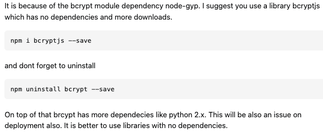

# Pain Point :star:

## :boom: bcrypt 설치 에러

`bcrypt` 를 설치 했는데 아래와 같은 오류가 발생했다.

```terminal
Error: Cannot find module 'E:\OneDrive\Documents\@mapbox\node-pre-gyp\bin\node-pre-gyp'
  at Function.Module._resolveFilename (internal/modules/cjs/loader.js:880:15)
  at Function.Module._load (internal/modules/cjs/loader.js:725:27)
  at Function.executeUserEntryPoint [as runMain] (internal/modules/run_main.js:72:12)
  at internal/main/run_main_module.js:17:47 {
code: 'MODULE_NOT_FOUND',
requireStack: []
}
npm WARN logresjwt@1.0.0 No description
npm WARN logresjwt@1.0.0 No repository field.

npm ERR! code ELIFECYCLE
npm ERR! errno 1
npm ERR! bcrypt@5.0.1 install: `node-pre-gyp install --fallback-to-build`
npm ERR! Exit status 1
npm ERR!
npm ERR! Failed at the bcrypt@5.0.1 install script.
npm ERR! This is probably not a problem with npm. There is likely additional logging output above.

npm ERR! A complete log of this run can be found in:
npm ERR!     C:\Users\ASUS\AppData\Roaming\npm-cache\_logs\2022-01-28T16_18_13_219Z-debug.log

PS E:\OneDrive\Documents\log&reg\logresjwt> node-pre-gyp install --fallback-to-build
node-pre-gyp : The term 'node-pre-gyp' is not recognized as the name of a cmdlet, function,
```

회원가입기능을 구현하는 중에 단순히 입력받은 내용을 MongoDB에 전송하는 것은 사용자의 정보가 날것의 상태로 존재하기 때문에 좋지 않아 그 값을 암호화하여 `.env` 파일에 저장함으로 사용자를 제외한 모든 사람이 그 정보를 알 수 없게 처리를 해야한다.

### 설치 명령어

```terminal
npm i bcrypt
```

그것을 위해 bcrypt를 사용하기로 했다.

강사님은 위의 명령어로 간단하게 install 하였고 정상적인 동작이 이루어졌다.

하지만, 본인의 환경에서는 에러가 발생했다. 🥲

구글링 결과 stackoverflow 에서 재설치를 권유했다.

### 🥺 시도한 해결방법 (1)

```terminal
npm uninstall bcrypt

npm install bcrypt
```

뭐든지 문제가 있는데 문제가 무엇인지를 모를 때는 재설치를 해보는 것은 좋은 생각이다.

하지만, 나의 경우는 이 방법으로는 문제가 해결되지 않았다.

### 🥺 시도한 해결방법 (2)

그래서 더 찾아본 결과 bcrypt module 의 dependency 의 문제라는 글을 확인 했고, 이것 방법을 시도해 보았다.

  

다행이도 에러 없이 다운로드가 완료되었고 별다른 문제가 보이지 않는것 같았다.

하지만 이것또한 눈속임일뿐.. 막상 코드를 실행시키니

```terminal
error: Error: Cannot find module 'bcrypt'
```

분명.. bcrypt를 다운완료 했고 위에 필요한 require 부분까지 모든 처리를 했지만. bcrypt 모듈을 찾을 수 없다는 에러 메시지가 나올 뿐이였다.

### 🥳 해결방법 (최종)

위의 해결방법을 마지막으로 강사님께 질문하던 그 때. 문뜩 옛날에 `npm install` 을 하면서 동작하지 않을때 `sudo`를 앞에 붙여 비밀번호를 입력하고 사용한것이 기억났다.

```terminal
sudo npm i bcrypt
```

를 입력하고 비밀번호를 입력하니 정상적으로 다운이 완료되었고.

실행 또한 정상적이였다.

## :guardsman: 느낀점

`npm install` 을 사용할 때 권한, 보통 슈퍼유저로서 프로그램을 구동하는데 필요한 부분이 있는데 정상 설치가 되지 않는다면 그것의 문제는 `sudo` 를 붙여 해결해 볼 수 있음을 기억해야겠다.

### 참고 사이트

[wikipedia] : <https://ko.wikipedia.org/wiki/Sudo>  
[npm] : <https://www.npmjs.com/package/bcrypt>  
[stackoverflow] : <https://stackoverflow.com/questions/70896941/npm-err-when-trying-to-install-bcrypt-on-npm-nodejs>
