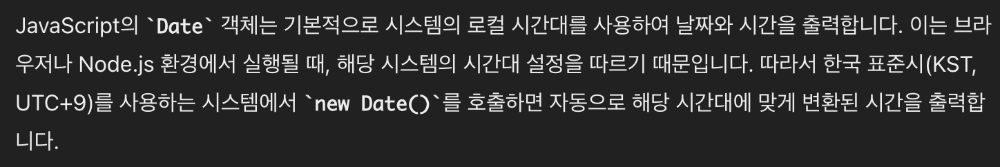

# Pain Point :star:

## :boom: Date() 함수로 생성된 날짜 데이터 오류

Mongoose로 생성된 날짜를 `Date`에 넣어 생성된 데이터의 처리 과정중 문제가 발생했다.

## APi Area

```js
// Long piece of code...
const PostSchema = new Schema({
  title: String,
  summary: String,
  content: String,
  cover: String,
  author: String,
  createdAt: Date,
  updatedAt: Date,
});
PostSchema.pre('save', function (next) {
  const currentDate = new Date();
  currentDate.setHours(currentDate.getHours() + 9);
  this.createdAt = currentDate;
  if (!this.createdAt) this.createdAt = currentDate;
  console.log(this.createdAt);
  console.log(this.updatedAt);
  next();
});
```

Api 에서 **_currentDate_** 에서 시간을 가지고오면 UTC 표준에 따라 대한민국과 9시간의 차이가 존재하기 때문에  
그것의 처리를 위해 9를 더해주는 과정을 진행했다.

## Client Area

```js
// Long piece of code...

const PostCard = ({ list }) => {
  const date = new Date(list.createdAt);
  const day = date.toLocaleDateString();
  const time = date.toLocaleTimeString([], {
    hour: '2-digit',
    minute: '2-digit',
  });
```

client 영역에서 예상한 날짜는 UTC + 9 로 한국시간이 출력되기를 기대했다.

하지만, 결과는 이상하게 9가 아닌 18이 더해진 값이 출력이 되었다.

### 🥺 시도한 해결방법(1)

#### MongoDB 초기 셋팅중 지역을 설정하면서 자동으로 지역 시간으로 설정?

`createdAt` 은 mongoDB의 확장 프로그램인 mongoose의 기능중 하나이다. 그렇기에 애초에 mongoDB와 관련 있는 값이기 때문에 혹시 초기에 지역을 설정한 부분에서 **친절하게** 처리를 해주는건가 라는 생각을 했지만, 어딜 봐도 그런 말은 찾을 수 없었고 chatGPT에 따르면 기본적으로 UTC 표준에 맞게 값이 생성된다는 답을 들었다.

### 🥺 시도한 해결방법(2)

#### Date 함수 자체에 지역을 설정해주는 기능이 있나?

자바스크립트를 공부했으면 이 가정은 틀렸다는 것을 알 수 있지만, 아래의 코드를 입력하고 결과는 마치
`Date()`속에 매게변수를 넣어주면 그 값을 지역에 맞는 값으로 변환해주는 것 같은 출력을 보여주었다.

```js
console.log('createdAt : ', list.createdAt);
console.log('date : ', date);
console.log('day : ', day);
console.log('time : ', time);
```

하지만 MDN 사이트에서 Date()에 변수를 넣어준다 한들 그 값이 지역 시간에 맞게 변화되는 내요은 전혀 없고 오로지 UTC 표준으로 값이 나오는 것을 알 수 있었다.

### 🥳 정답은 `terminal`과 `브라우저의 console영역`에서의 출력의 차이.

어떤 문제인지를 찾지못해 해매던 중 ChatGPT가 여러 문제의 가능성을 보여주었는데 그중 아래의 문제를 보았다.


이것을 보고 브라우저에서 Console 에서의 출력과 VSC의 터미널에서의 출력 상태를 비교해보기로 했다.

```js
const date = new Date().toISOString();
const currentDate = new Date(date);
```

```web
terminal output
date :  2024-05-24T08:33:45.473Z
curr :  2024-05-24T08:33:45.473Z


web console output
date : 2024-05-24T08:35:11.519Z
curr : Fri May 24 2024 17:35:11 GMT+0900 (한국 표준시)
```

## :guardsman: 느낀점

`터미널`은 주로 스크립트 실행, 코드 컴파일, Git과 같은 버전 제어 시스템 관리, 프로젝트 개발과 관련된 다양한 작업 수행에 사용하고,
`콘솔 영역`은 터미널처럼 JavaScript 코드를 디버그 할 수 있으며 요소를 검사하고 네트워크 활동을 모니터링 하고 JavaScript 명령을 실행하고 디버깅 목적으로 메시지를 기록 할 수있다.
개발을 하면서 이 둘의 차이를 크게 느낄 순간이 없었기에 터미널과 웹 Console은 애초에 같은것이라고 생각했다. 하지만 이번에 발생한 문제로 알아본 결과 터미널과 콘솔은 모두 명령을 실행하고 코드와 상호 작용할 수 있지만 위와 같이 브라우저의 콘솔은 사용 국가에 따라서 내장 함수로 실행된 값이 변동 될 수 있음을 확인했고 값을 가공하는 단계에서 고려해야할 부분을 학습할 수 있었다.

### 참고 사이트

[mdn] : <https://developer.mozilla.org/ko/docs/Web/JavaScript/Reference/Global_Objects/Date>  
[w3schools] : <https://www.w3schools.com/js/js_dates.asp>
